# 教室で使えるかもしれないもの作り #◯ 「書いて、出して、返ってきて、おしまい」にしない。クラスの作文が一冊の本になるアプリ「オンライン出版社 Pro」

## 🏫 はじめに

作文の時間、こんなふうになっていませんか。

原稿用紙を配って、書かせて、集める。放課後に赤ペンで直して、次の日に返す。直したものをまた集める。ようやく全員ぶんが終わったころには、子どもたちは次の単元に進んでいて、あの作文がどうなったのかを覚えているのは先生だけ。書いたものは先生しか読んでいません。

清書もむずかしいところです。せっかくいい文章が書けても、マス目に写しなおすだけで一時間が消えていきます。挿絵を描かせたいけれど、紙を貼るとかさばるし、印刷にも回せません。

「オンライン出版社 Pro」は、そのあたりをまるごと引き受けるつもりで作ったWebアプリです。子どもは端末で書き、画面の中の縦書き原稿用紙にそのまま組まれていきます。先生はその原稿用紙の上を指でなぞって赤を入れ、子どもはその赤を読んで直します。完成した作品は「みんなの作品だな」に本として並び、クラスのだれもが読んで感想を送れます。

配布はGitHubからです。

https://github.com/GIGAyama/Online-Publisher-pro

学校のGoogleアカウントがあれば動きます。サーバーの契約もいりませんし、ビルドの作業もありません。2つのファイルをコピーして貼るだけです。くわしくは後半の導入手順に書きました。

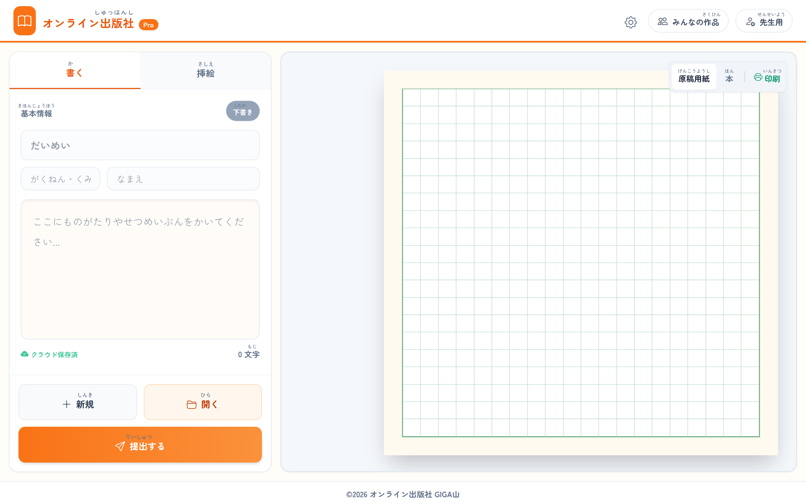

児童モードの初期画面。左が書くところ、右が原稿用紙のプレビューです。

## 📱 このアプリでできること

画面は3つのモードでできています。子どもが書く「児童モード」、読み合う「みんなの作品だな」、先生が添削する「先生用」。上のバーの色が、オレンジ、緑、赤と変わるので、いまどこにいるかがひと目で分かります。児童モードと作品だなはログインなしで使えて、先生用だけパスワードがかかります。

まずは書くところから。だいめい、がくねん・くみ、なまえ、そして本文。打った先から右側の原稿用紙に流れこんでいきます。マス目に文字が入っていくようすが見えるので、あと何行で終わるのかが子どもにも分かります。入力欄の右下には改行を除いた文字数が出ます。四百字詰めであと何マス、という話が、そのままできます。

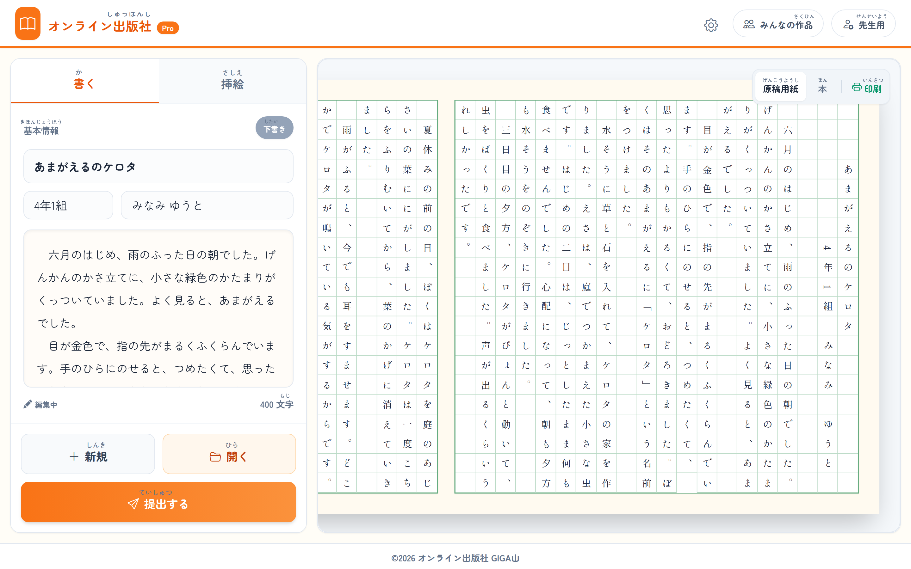

打った文字が右の原稿用紙にそのまま組まれていきます。この時点で356文字です。

原稿用紙は20文字×20行と15文字×16行の2種類から選べます。高学年と低学年で使い分けてください。行の頭に句読点が来てしまったときの処理も、次の行に送る「追い出し」と、マスの外に小さく出す「ぶら下がり」から選べます。ここは先生の指導のしかたに合わせるところなので、決め打ちにしませんでした。設定は端末に残るので、一度選べば次からそのままです。

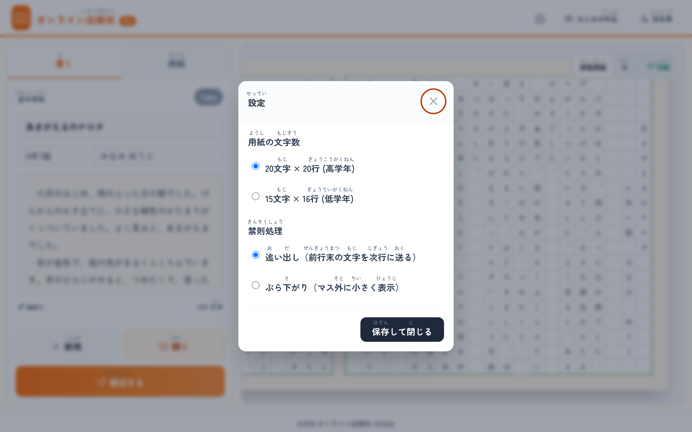

歯車のボタンから開く用紙の設定です。

保存ボタンはありません。作らなかった、というほうが正確です。子どもが「保存」を押し忘れて一時間ぶんが消えた、という事故をなくしたかったからです。入力が20秒止まると自動で保存され、タブを閉じたり別のアプリに切り替えたりした瞬間にも保存されます。いまどの状態なのかは本文の下に出ます。編集中、保存中、クラウド保存済。通信が切れているときは端末の中にいったん置いておいて、つながった時点で自動で送ります。

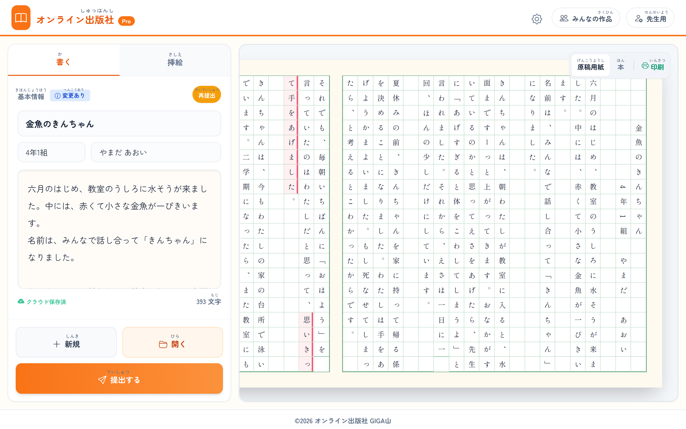

左下に「クラウド保存済」と出ています。子どもは保存を意識しなくてかまいません。

挿絵も入れられます。撮った写真や描いた絵を選ぶと、端末の中で幅800ピクセルまで小さくしてから送るので、通信が細い教室でも詰まりにくいはずです。何ページ目に置くか、大きさは30%から150%のどのくらいか、切り抜きの形は8種類のどれか。まる、ほしがた、ふわふわ。この形えらびは、正直なところ機能としては要らないものです。それでも入れたのは、自分の作品の見た目を自分で決める時間そのものが、書くことへの気もちを上げてくれると思ったからです。

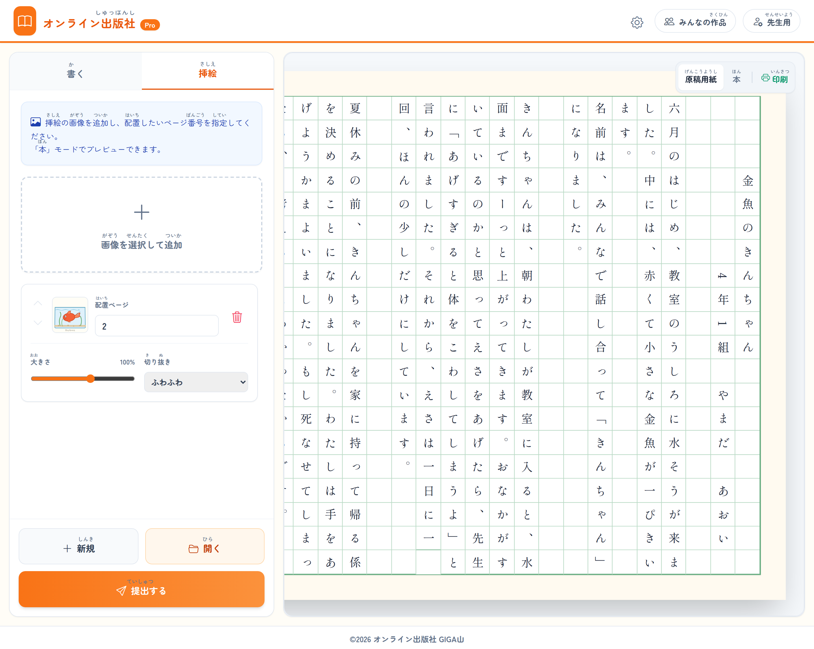

配置ページ、大きさ、切り抜きの形を挿絵ごとに決められます。

プレビューには原稿用紙のほかに「本」があります。1ページ目が表紙になり、題名と学年組と名前が縦書きで入ります。2ページ目からが本文で、指定したページの上に挿絵が並びます。挿絵を置いたページは、本文の1行の文字数が自動で少なくなって、絵の下におさまるように組みなおされます。

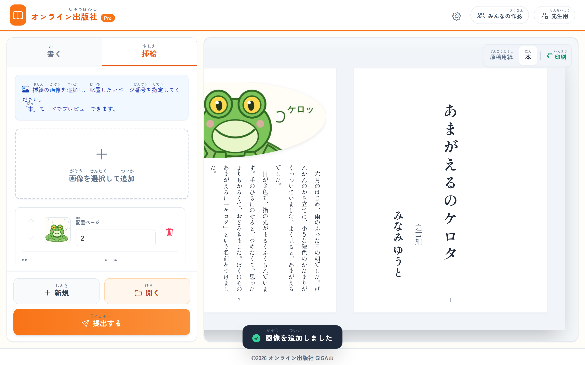

右が表紙、左が挿絵の入った2ページ目です。挿絵が出るのは本モードだけです。

印刷はA4横です。原稿用紙を表示しているときは、まん中に綴じ代のある見開きの原稿用紙として出ます。題名とページ番号も入ります。本を表示しているときは、見開き2ページを1枚に並べて出します。学級通信に載せるにも、教室に掲示するにも、そのまま使えます。

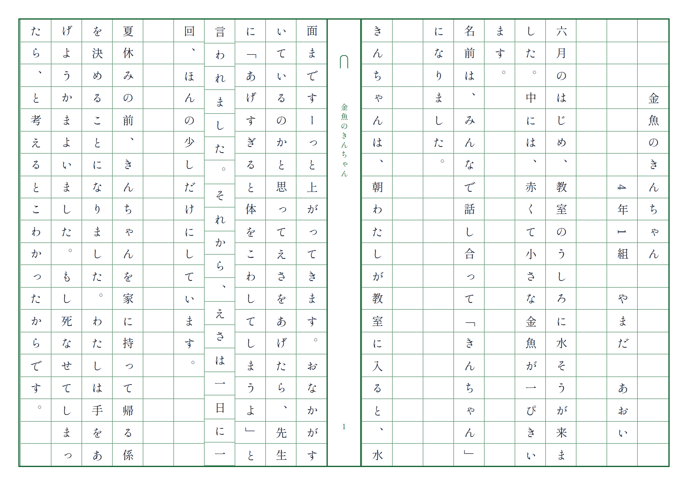

原稿用紙表示のまま印刷したところ。中央の帯に題名とページ番号が入ります。

書き終えたら「提出する」を押します。提出した作品は編集できなくなります。かわりにボタンが「コピーして新しく書く」に変わるので、挿絵ごと複製して書き直すことはできます。前に書いたものを消さずに、二作目として書ける形にしました。

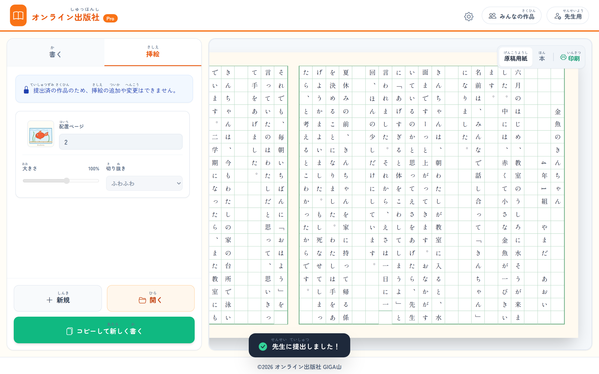

提出すると鍵がかかり、ボタンが「コピーして新しく書く」に変わります。

## ✍️ 原稿用紙の上に、そのまま赤を入れる

ここがこのアプリでいちばん時間をかけたところです。

先生用のボタンからパスワードを入れると、提出物の一覧が出ます。初回のパスワードは admin です。かならず変えてください。

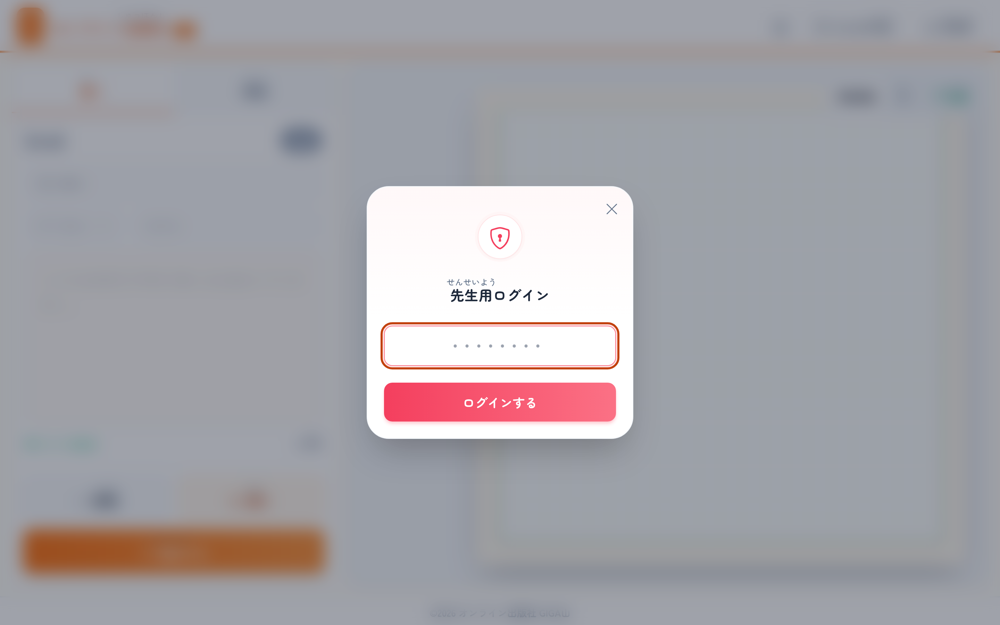

先生用だけパスワードがかかります。児童モードとギャラリーはログインなしです。

一覧には下書き以外の作品が、更新の新しい順に並びます。名前と題名とステータスが見えて、キーワードでも、提出済や再提出といった状態でも、更新日の範囲でも絞りこめます。三十人ぶんが並んでも、まだ見ていない子から順に開いていけます。

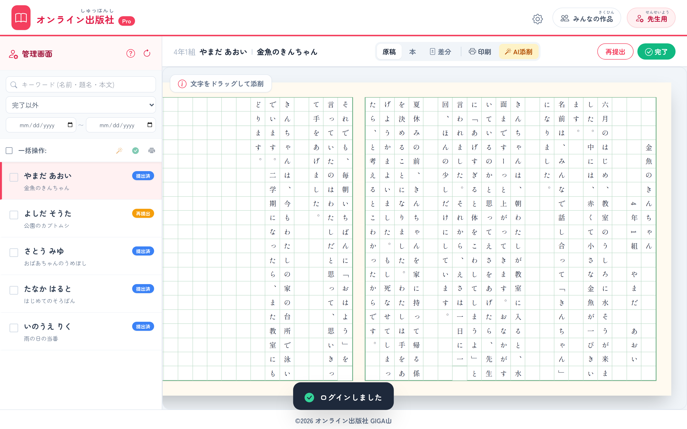

左が一覧、右が添削画面です。名前・題名・本文のどれでも検索できます。

添削は、原稿用紙の上を直接ドラッグします。指摘したい文字をなぞって指を離すと、コメントを書く欄が開きます。タブレットのときは、文字を長押ししてからなぞってください。短くなぞるとスクロールになります。書いて「追加する」を押すと、その範囲に赤い線が付きます。

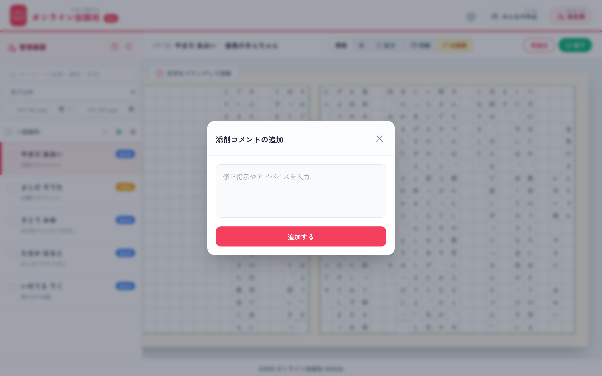

なぞって離すと、この欄が開きます。

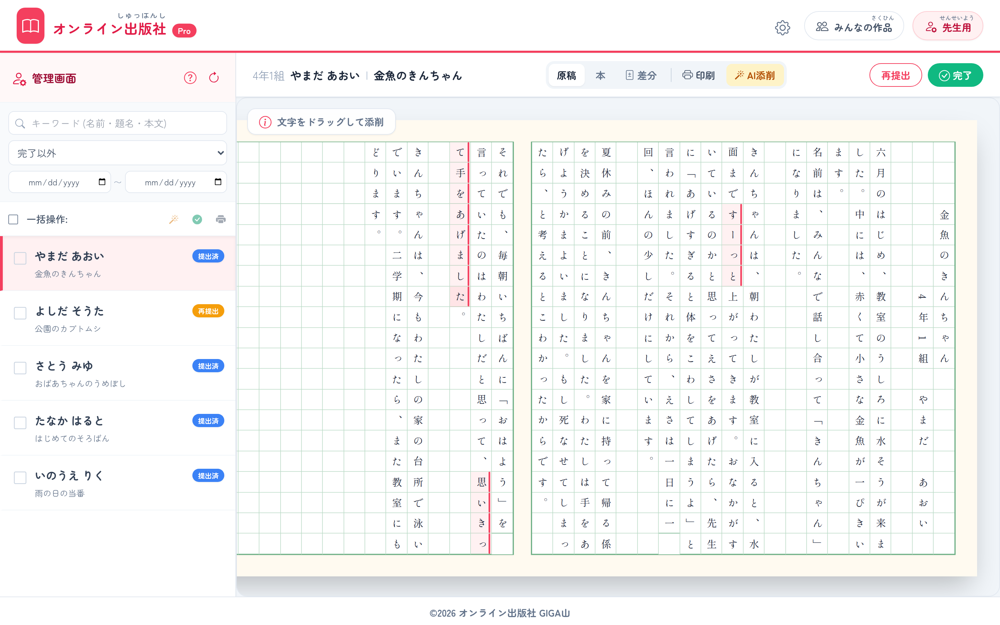

「すーっと」と「思いきって手をあげました」の2か所に赤が入りました。

紙の赤ペンとちがうのは、子どもの側でこの赤が読めることです。子どもが赤い印の付いた文字をタップすると、先生のコメントが開きます。読んで直したら「修正完了」を押します。すると、その赤線は子どもの画面から消えます。先生の画面には緑色で残るので、どのコメントが届いたのかが分かります。

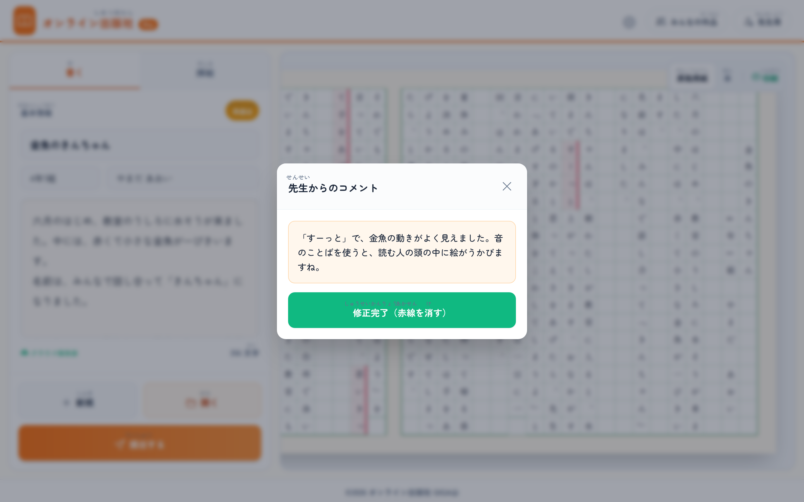

赤い印をタップすると、先生のコメントが開きます。

赤入れそのものを手伝わせることもできます。AI添削のボタンを押すと、GoogleのAI（Gemini）が誤字脱字や表現の改善点、それに良かったところを、小学生に伝わる言葉で挙げてきます。指摘は本文の該当する場所に、頭に【AI】と付いた赤線として入ります。一覧でチェックを入れれば、選んだ作品をまとめて処理することもできます。

これは下書きを作らせているだけだと思ってください。AIの指摘をそのまま子どもに返すつもりはありませんでした。要らないものはクリックして消せますし、言い回しを先生の言葉に書き換えることもできます。三十人ぶんの誤字探しをAIに任せて、先生は「この子に何を伝えるか」に時間を使う。そういう分担のつもりで付けました。使うにはGeminiのキーを登録する必要があります。登録しないかぎりAIには一切つながりません。

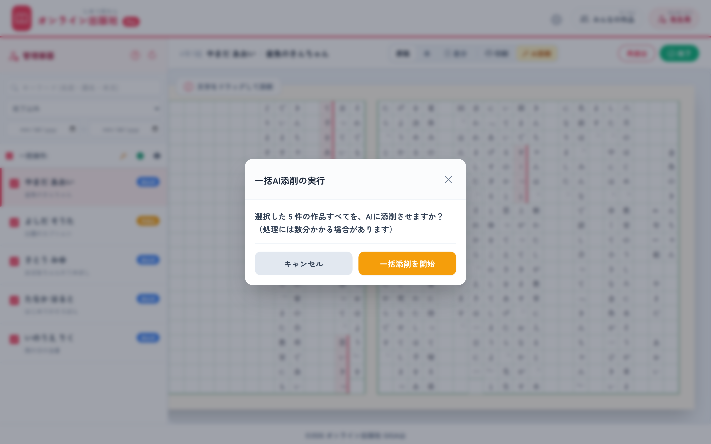

チェックを入れた作品をまとめて処理できます。件数が多いと数分かかります。

再提出で返した作品が直って戻ってきたとき、どこが変わったのかを探すのはけっこうな手間です。そのための「差分」があります。前回添削したときの本文といまの本文をくらべて、書き足されたところを緑、消えたところを赤の取り消し線で出します。全文を読みなおさなくても、直したところだけが目に飛びこんできます。

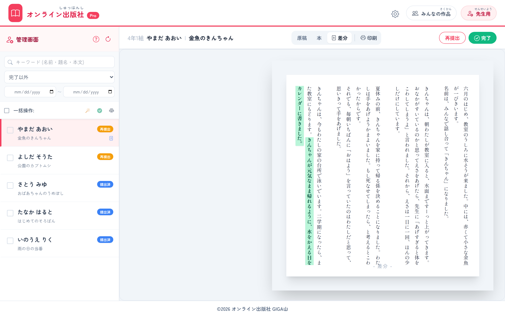

緑のところが、子どもが書き足した文です。

一覧と添削画面のあいだを行ったり来たりする作業なので、キーボードだけでも進められるようにしました。上下キーで子どもを切り替え、Vで表示を切り替え、Cで完了、Rで再提出。はてなキーを押すと、いま使える11個のキーが一覧で出ます。

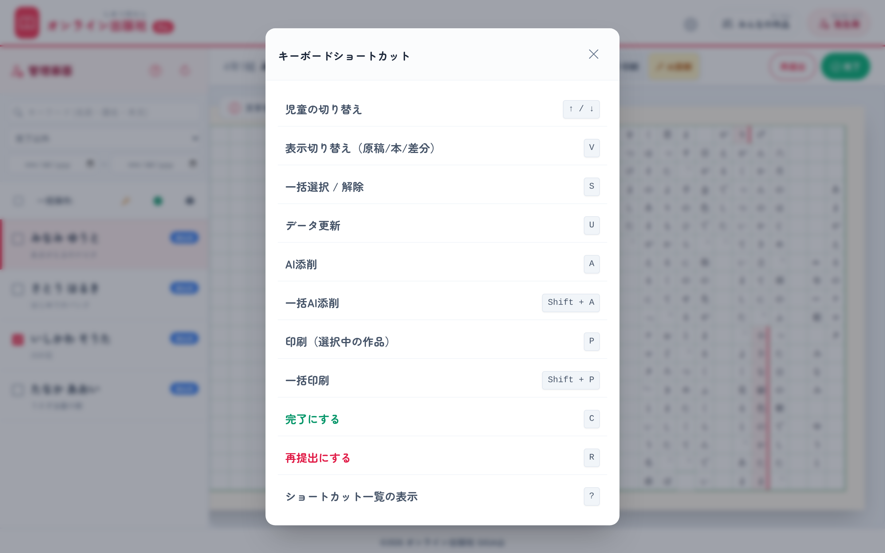

はてなキーで開きます。入力欄にカーソルがあるときは動きません。

## 📚 書いた作文が、みんなで読める一冊の本になる

提出済と完了になった作品は、「みんなの作品だな」に本の背表紙のように並びます。感想が付いている作品には、右上に件数のバッジが出ます。

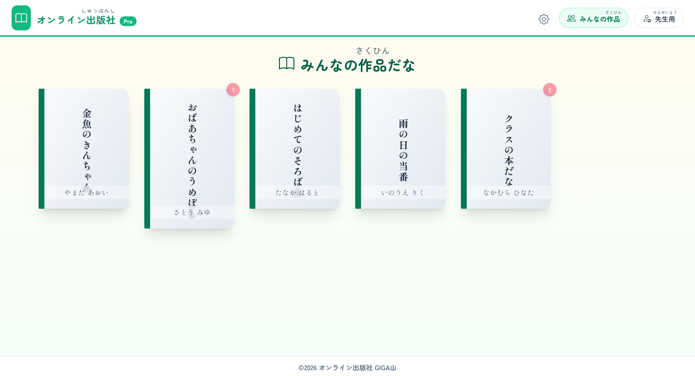

提出済と完了の作品が並びます。感想の付いた本にはバッジが出ます。

一冊選ぶと、画面いっぱいのリーダーが開きます。縦書きなので右から左へ、矢印キーか画面の矢印、タブレットならスワイプでめくっていきます。挿絵を置いたページでは、絵と文章がいっしょに出ます。書いた本人にとっては、自分の書いたものがちゃんと本の形をしているという、それだけのことがうれしいのではないかと思っています。

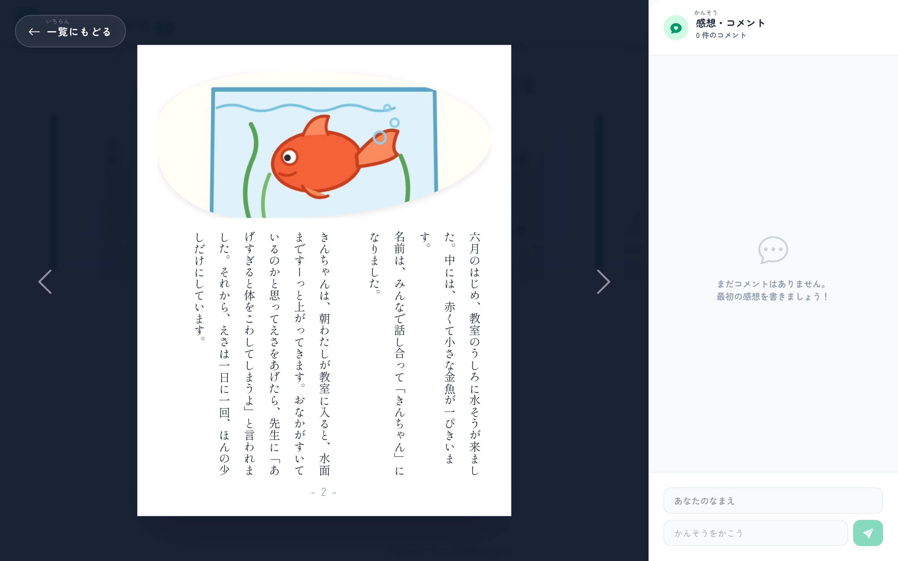

全画面のリーダー。右から左へめくります。

読んだら感想を送れます。名前と一言を書いて送信するだけです。名前を空けたまま送ると「名無し」になります。書いた子には、先生以外のだれかが読んでくれたという事実が残ります。作文を「先生に出すもの」から「だれかに読んでもらうもの」に変えたかった、というのがこの画面を作った理由です。

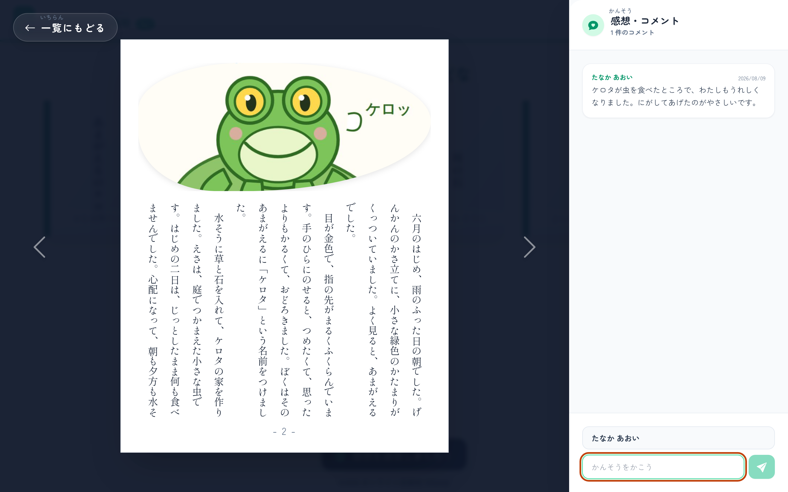

送った感想はすぐに一覧に出ます。

なお、感想を消す機能はアプリの中にありません。困った投稿があったときは、あとで説明するスプレッドシートの行を消してください。むやみに消せる機能を子どもの画面に置きたくなかったので、こうしています。

端末を選ばないのも大事にしたところです。Chromebookでも、タブレットでも、家のスマートフォンでも、画面の大きさに合わせて形が変わります。小さい画面では「かく」と「プレビュー」がタブに分かれて、それぞれ全画面で使えます。

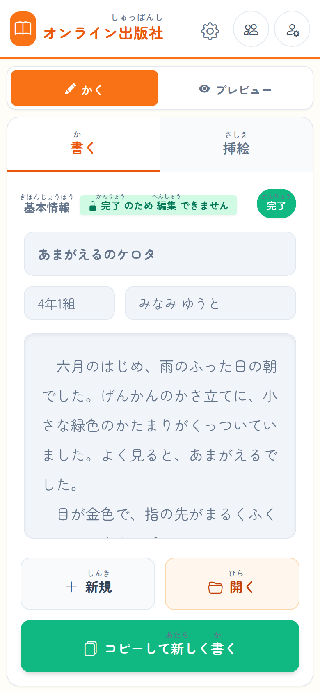

小さい画面では「かく」と「プレビュー」を切り替えて使います。

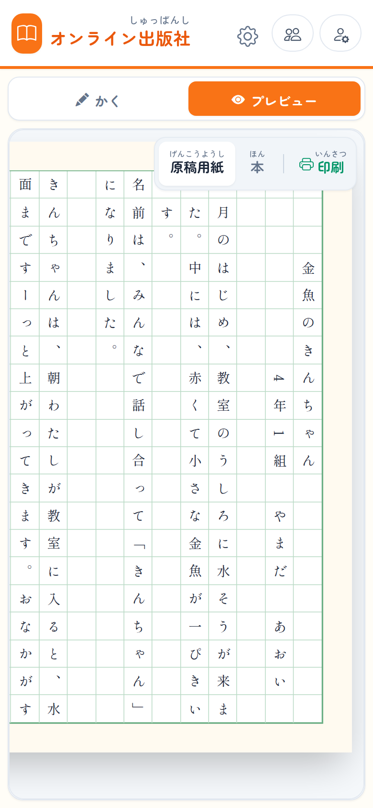

プレビュー側もこのとおり全画面です。

## ✨ 導入のメリット

三つのいいことが期待できます。

一つ目は、集めて配ってをくり返す時間がなくなることです。子どもが提出したら先生の一覧にすぐ並び、先生が完了にしたら子どもの画面にすぐ届きます。放課後に三十枚の原稿用紙をそろえて、翌朝また配る、という往復がまるごとなくなります。紙が一枚だけ行方不明になって心当たりを探す、あの時間もです。

二つ目は、赤ペンを入れる場所が変わることです。誤字脱字の指摘をAIに下書きさせておけば、先生が向き合うのは「この子はここで何を言いたかったのか」という一点になります。差分表示のおかげで、直ったところを探す手間もかかりません。同じ三十分でも、そこで書ける言葉の中身が変わってくると思います。

三つ目は、書いたものに読み手ができることです。作品だなに並んで、だれかが感想を送ってくれる。それは、先生が百回「上手に書けたね」と言うのとは別の種類の手ごたえだと思います。読まれると分かっていることが次の一枚に向かう力になる、というのは、大人も子どもも同じではないでしょうか。

## 🛠️ 【管理者向け】導入手順

このアプリはGoogle Apps Scriptの上で動きます。学校のGoogle Workspaceアカウントがあれば、それだけで足ります。ビルドの作業はありません。

データの置き場所は、初回に開いたときに自動でできます。作文と感想はスプレッドシート、挿絵の画像はGoogleドライブのフォルダに入ります。どちらもデプロイした先生のマイドライブの中です。手で消してしまっても、次に開いたときに作り直されます。

導入の手順です。

1. GitHubのリポジトリから `code.gs` と `index.html` を開きます。
2. Google Apps Script で新しいプロジェクトを作ります。
3. 最初からある「コード.gs」に、`code.gs` の中身をまるごと貼ります。
4. 左の「＋」からHTMLファイルを作り、名前を `index` にします。そこに `index.html` の中身を貼ります。
5. 右上の「デプロイ」から「新しいデプロイ」を選び、種類を「ウェブアプリ」にします。実行するユーザーは自分、アクセスできるユーザーは学校の方針に合わせて選びます。
6. 初回は承認の警告が出ます。「詳細を表示」から進んで許可してください。
7. 発行されたURLを開き、右上の「先生用」からパスワード `admin` でログインします。
8. 歯車のボタンを開いて、パスワードを必ず変えます。AI添削を使うなら、ここでGeminiのキーも登録します。

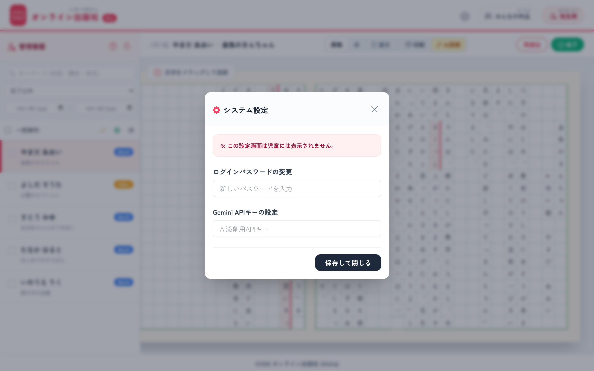

先生モードで歯車を押すと開きます。この画面は児童モードには出ません。

情報担当の先生に確認されることを、先に書いておきます。

校内のフィルタリングでは、次のアドレスを通す必要があります。画面の見た目と文字の表示に使っているものです。

- script.google.com（アプリ本体）
- cdn.tailwindcss.com、unpkg.com、cdn.jsdelivr.net、cdnjs.cloudflare.com（画面を組み立てる部品）
- fonts.googleapis.com、fonts.gstatic.com（丸ゴシックと明朝の書体）
- lh3.googleusercontent.com（挿絵の表示）
- generativelanguage.googleapis.com（AI添削を使うときだけ）

個人情報については、次の3つを押さえておいてください。

まず、児童モードにログインはありません。「開く」で出る一覧には、そのアプリに入っている全員ぶんの作品が並びます。ほかの子の作品を開くこともできます。同じクラスや学年の中で使うことを前提にした作りなので、学年をまたいで一つのアプリを共有するのは避けてください。

次に、挿絵の画像を入れるドライブのフォルダは「リンクを知っている全員が閲覧可」になります。画面に画像を出すためにこうしています。顔の写った写真をアップロードさせるかどうかは、この点をふまえて決めてください。

最後に、先生用のパスワードはGoogle Apps Scriptのプロジェクト設定の中に、そのままの文字で入っています。ログインを忘れたときはそこで確認できますが、児童の目に触れる場所で開かないでください。

なお、パスワードの変更、キーの登録、AI添削、先生用の一覧の取り出しは、いずれもサーバー側でパスワードを確かめてから動きます。子どもの画面からこれらを実行することはできません。

作品を消す機能はアプリの中にありません。消したい作品があるときは、スプレッドシート「作文データ」のその行の「削除日時」の列に日付を入れてください。どの画面にも出てこなくなります。

もう一つ、アプリのように起動したい場合の話です。リポジトリの `pwa` フォルダを GitHub Pages などに置くと、アプリのURLを包んで全画面で開くだけの入口ができます。初回にアプリのURLを一度入れると、次からはアイコンから直接起動できます。先生が `?app=` の形でURLを付けたリンクを配れば、子どもの入力もいりません。

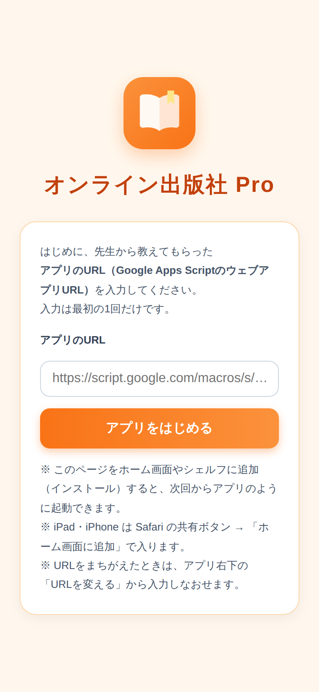

最初の一回だけアプリのURLを入れる画面です。

## 📖 【利用者向け】使い方のガイド

子どもに配る手順です。

1. 先生から教えてもらったURLを開きます。
2. 「だいめい」「がくねん・くみ」「なまえ」を入れます。
3. 大きな枠に本文を書きます。右の原稿用紙にすぐ出てきます。
4. 絵を入れるときは「挿絵」を開き、「画像を選択して追加」から選びます。何ページ目に置くか、大きさ、形を決めます。
5. 右上の「本」を押すと、本の形で見られます。
6. 書けたら「提出する」を押します。
7. 先生が赤を入れて返してくれたら、赤い印の文字をタップしてコメントを読みます。直したら「修正完了」を押します。
8. 読み合うときは、上の「みんなの作品」を押して、読みたい本を選びます。読んだら感想を送りましょう。

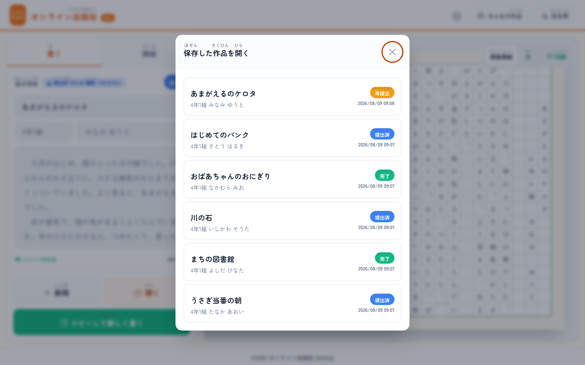

「開く」を押すと、保存されている作品から選べます。自分の名前を目印に探してください。

先生の手順です。

1. 右上の「先生用」からパスワードを入れてログインします。
2. 左の一覧から作品を選びます。まだ見ていない子は、絞りこみを「提出済」にすると探しやすくなります。
3. 直したいところを原稿用紙の上でドラッグして、コメントを書き、「追加する」を押します。タブレットでは長押ししてからなぞります。
4. 誤字脱字を先にAIに拾わせたいときは「AI添削」を押します。要らない指摘はクリックして消します。
5. 書き直させたいときは「再提出」、これでよければ「完了」を押します。
6. 戻ってきた作品は「差分」を開くと、直したところが緑で出ます。
7. まとめて処理したいときは、一覧のチェックを入れてから上のボタンを押します。まとめてAI添削、まとめて完了、まとめて印刷ができます。

## 📝 まとめ

このアプリで短くなるのは、集めて、配って、また集める時間です。丸付けや添削そのものを機械に任せたかったわけではありません。

浮いた時間で何をするかは、たぶん先生ごとにちがいます。私は、一人の子の原稿用紙の前でもう少し長く止まっていられたらいいと思って作りました。「ここ、どうして手をあげようと思ったの」と聞ける時間が、一日にひとつでも増えたら十分です。効率化そのものが目的ではなくて、子どもと向き合う時間をどこかから作るための道具だと思っています。

うまくいくかどうかは、正直なところ使ってみないと分かりません。それでも、作文が先生と子どもの一対一のやりとりで閉じてしまうのは、もったいないとずっと思っていました。書いたものが本の形になって、クラスのだれかが読んで、感想が返ってくる。その一往復が起きたらいいなと思って、この形にしました。

もし合いそうだと思われたら、まずは一つの単元だけ、一クラスだけで試してみてください。合わなければやめればいいですし、ここが使いにくいという声はいつでも聞かせてください。

一歩踏み出そうとする先生を、私はいつでも全力で応援しています。
